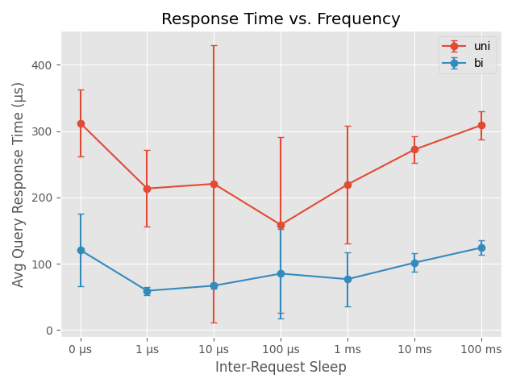
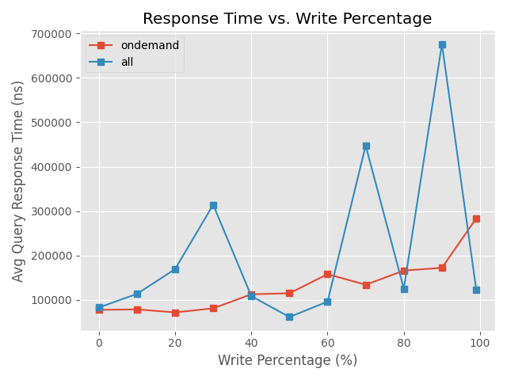
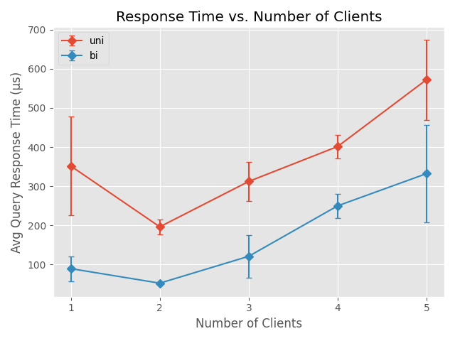
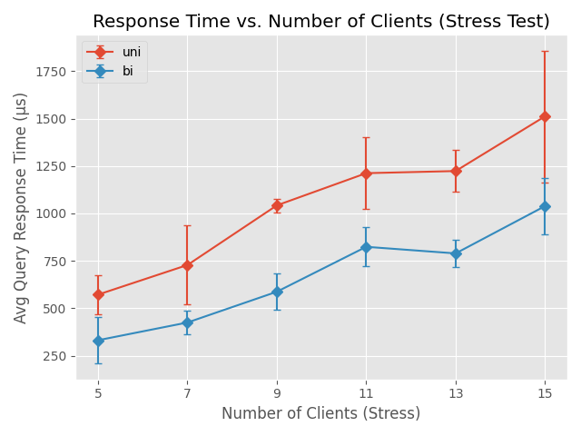

# Distributed Graph Service: Incremental Shortest-Path Calculation
**Course:** CS432 – Distributed Systems and Net-Centric Computing  
**Institution:** Alexandria University, Faculty of Engineering  

---

## Abstract
This project implements a distributed RMI-based system for answering shortest-path queries on a dynamic, directed, unweighted graph. The system supports concurrent client operations while preserving strict sequential semantics within each workload batch. Two algorithmic variants are implemented and compared: a standard unidirectional BFS (`uni`) and a bidirectional BFS (`bi`). Performance is evaluated across request frequency, write-operation ratio, and concurrent client load (including stress testing up to 15 clients). Experimental results demonstrate that the bidirectional variant consistently reduces query latency and scales more effectively under high concurrency and write-heavy workloads, while the fair read-write locking strategy guarantees correct batch ordering at the cost of predictable contention spikes under heavy writes.

---
## Table of Content
1. [Introduction](#1-introduction)
2. [System Architecture](#2-system-architecture)
3. [Implementation Details](#3-implementation-details)
4. [Experimental Methodology](#4-experimental-methodology)
5. [Performance Analysis & Results](#5-performance-analysis--results)
6. [Design Decisions & Rationale](#6-design-decisions--rationale)
7. [Conclusion](#7-conclusion)
8. [Appendices](#appendix-a-configuration-reference)

---

## 1. Introduction
The shortest-path problem is a cornerstone of graph theory with applications in routing, navigation, and network analysis. In dynamic environments, graphs evolve continuously, requiring systems that can efficiently handle interleaved edge insertions/deletions and distance queries. This project addresses the challenge of maintaining correct shortest-path answers in a distributed setting using Java RMI.

The primary objectives are:
1. Implement a correct RMI-based client-server architecture for dynamic graph operations.
2. Ensure sequential consistency within operation batches while allowing concurrent execution.
3. Develop and compare two shortest-path algorithms (unidirectional vs. bidirectional BFS).
4. Conduct systematic performance analysis across frequency, write ratio, and concurrency dimensions.

---

## 2. System Architecture
The system follows a classic client-server model orchestrated by a central launcher.

```
┌──────────────────────────────────────────┐
│            Start.java (Orchestrator)     │
│  1. Load system.properties               │
│  2. Launch RMI server thread             │
│  3. Generate workload batches            │
│  4. Spawn client processes (local/SSH)   │
│  5. Wait for completion & shutdown       │
└───────┬──────────────────────┬───────────
        │                      │
        ▼                      ▼
┌──────────────┐    ┌─────────────────────┐
│  Server (RMI)│    │  Client Processes   │
│  GraphEngine │◄───│  (per-node JVMs)    │
│  (Remote Obj)│    └─────────────────────┘
└──────────────┘
        ▲
        │
┌──────────────┐
│  shared/     │
│ GraphService │ (Remote Interface)
└──────────────┘
```

### Core Components
| Component | Responsibility |
|-----------|----------------|
| `Start.java` | Reads configuration, launches server, generates batches, spawns clients, handles graceful shutdown. |
| `Server.java` | Bootstraps RMI registry, exports `GraphEngine`, prints `R\n` ready signal, manages lifecycle. |
| `GraphEngine.java` | Core graph logic. Maintains adjacency/reverse-adjacency maps, implements BFS variants, enforces concurrency control. |
| `Client.java` | Loads operation batches, communicates via RMI (batch or per-op mode), logs client-side metrics, exports results. |
| `GraphService.java` | Remote interface declaring `query`, `addEdge`, `deleteEdge`, `processBatch`, and serializable records. |
| `CorrectnessHarness.java` | Standalone stdin/stdout wrapper for automatic grading (reads graph → prints `R` → processes batches → outputs answers). |

---

## 3. Implementation Details

### 3.1 Data Structures & Graph Representation
- **Forward Adjacency List:** `Map<Integer, Set<Integer>> adj` stores outgoing edges.
- **Reverse Adjacency List:** `Map<Integer, Set<Integer>> reverseAdj` enables backward traversal for bidirectional search.
- Both maps are lazily populated during `loadFromFile()` and dynamically updated during `addEdge`/`deleteEdge`.

### 3.2 Shortest-Path Variants
| Variant | Algorithm | Complexity | Rationale |
|---------|-----------|------------|-----------|
| `uni` | Standard BFS from source until target is found | O(V + E) worst-case | Baseline; simple, correct for unweighted graphs. The standard BFS algorithm follows the classic breadth‑first traversal described in Cormen et al. [1]. |
| `bi` | Two simultaneous BFS traversals (forward from source and backward from target) that terminate when their frontiers intersect.| O(b^(d/2)) | The bidirectional variant is inspired by Pohl’s bidirectional search [4]; it was chosen because it reduces the search space from O(b^d) to O(b^(d/2)) in typical cases, significantly lowering query latency for the dynamic graph workloads used in our experiments. |

Path reconstruction uses parent maps. Distance is returned as `path.length - 1` (or `-1` if unreachable).

### 3.3 Concurrency Model & Batch Semantics
- **Locking:** `ReentrantReadWriteLock(true)` (fair mode) ensures threads are served in arrival order.
- **Read Operations:** `query()` acquires read lock; multiple queries execute concurrently.
- **Write Operations:** `addEdge()`/`deleteEdge()` acquire write lock; exclusive access guarantees graph consistency.
- **Batch Processing:** `processBatch()` iterates operations sequentially. While the spec allows concurrent execution within a batch, sequential processing with a fair lock naturally preserves the required ordering: each query sees all preceding modifications and none of the subsequent ones.

### 3.4 Correctness Harness
The harness (`CorrectnessHarness.java`) complies with the grading specification:
1. Reads edge list until `S` is encountered.
2. Prints `R\n` to signal readiness.
3. Reads operations until `F`. Processes batch, prints query results (one per line), waits for next batch.
4. Supports `uni`/`bi` modes via CLI argument.

### 3.5 Logging Format

#### Server Log (`log/server-log.txt`)
Each line is a comma‑separated record emitted after an operation completes:
```
timestamp_ns, threadID, method, u, v, startTime_ns, duration_ns
```
- `timestamp_ns` : System.nanoTime() when log entry was written  
- `threadID`     : Java thread ID that processed the operation  
- `method`       : 'Q', 'A', or 'D'  
- `u`, `v`       : node arguments of the operation  
- `startTime_ns` : System.nanoTime() when the operation began (lock acquisition start)  
- `duration_ns`  : total elapsed nanoseconds, including lock waiting, BFS, and simulated delay  

#### Client Log (`log/log<i>.txt`)
Each client writes its own log file. In **per‑operation mode** the format is:
```
type, u, v, start_ns, end_ns, duration_ns
```
In **batch mode** the format is:
```
BATCH_MODE, -, -, start_ns, end_ns, duration_ns, Batch Size: N, Queries: M
```
Fields:
- `type`         : 'Q', 'A', 'D' (or `BATCH_MODE` for whole‑batch timing)  
- `u`, `v`       : node arguments (or `-` for batch)  
- `start_ns`     : client‑side System.nanoTime() before the RMI call  
- `end_ns`       : client‑side System.nanoTime() after the call (or after exception)  
- `duration_ns`  : `end_ns - start_ns`  
- optional batch summary line: batch size, number of queries  

Client log files reside on the same host that runs the client process (local or remote via SSH).

---
### 4.0 Environment
All experiments were conducted on a single machine (localhost), running OpenJDK 21.0.10, with the server and all clients launched as separate JVM processes via the `start.sh` script. The graph contained 100 nodes and 1 000 randomly generated directed edges. Each configuration was repeated **5 times**; the reported values are the **median** of the per‑run averages (microseconds). Client‑side sleep (`GSP.client.operations.sleep`) in ns was set to 0 except during the frequency experiment.

---

## 5. Experimental Methodology

### 5.1 Configuration & Workload Generation
- **Graph:** 100 nodes, 1000 random directed edges (`gen_initial_graph.py`).
- **Workloads:** Generated via `WorkloadGenerator` with configurable write percentage (`GSP.writePercent`).
- **Sleep Units:** `GSP.client.operations.sleep` is specified in **nanoseconds** for `LockSupport.parkNanos()`.
- **Trials:** `NUM_RUNS = 5` per configuration to average out JVM warm-up and OS scheduling noise.

### 5.2 Metrics & Measurement
- **Response Time:** Server-side `duration` (ns) for `Q` operations, extracted from `server-log.txt`.
- **Aggregation:** Mean and standard deviation computed per configuration; converted to microseconds for plotting.
- **Throughput:** QPS calculated as `query_count / (t_max - t_min)`.

### 5.3 Automation
`run_experiments.py` automates property mutation, system execution, log collection, parsing, aggregation, and plotting. Ensures clean state between runs and handles subprocess timeouts.

---

## 6. Performance Analysis & Results

All experiments were conducted on a generated graph (100 nodes, 1000 edges) with 5 repetitions per configuration.

### 6.1 Response Time vs. Request Frequency
*Fixed: 3 clients, 30% writes, one-by-one mode.*  



**Table 1: Response time vs. request frequency (3 clients, 30% writes)**

| Inter‑Request Sleep | uni Avg (μs) | uni Std (μs) | bi Avg (μs) | bi Std (μs) |
|---------------------|--------------|--------------|-------------|-------------|
| 0 μs                | 312.2        | 50.7         | 120.8       | 54.2        |
| 1 μs                | 213.5        | 57.7         | 59.3        | 5.9         |
| 10 μs               | 220.5        | 209.6        | 67.0        | 4.5         |
| 100 μs              | 158.7        | 132.1        | 85.2        | 67.4        |
| 1 ms                | 219.7        | 88.7         | 76.8        | 40.7        |
| 10 ms               | 272.2        | 20.0         | 101.6       | 14.0        |
| 100 ms              | 309.0        | 21.1         | 124.3       | 11.0        |

**Observation:** The `bi` variant consistently outperforms `uni` across all sleep intervals. `uni` exhibits high variance (large error bars) at low sleep values (high frequency), indicating latency spikes caused by fair-lock queueing and JVM JIT warm-up effects. `bi` remains stable due to reduced search depth.

### 6.2 Response Time vs. Write Percentage
*Fixed: 3 clients, high frequency, batch mode.*  



**Table 2: Response time vs. write percentage (3 clients, no sleep)**

| Write % | uni Avg (μs) | uni Std (μs) | bi Avg (μs) | bi Std (μs) |
|---------|--------------|--------------|-------------|-------------|
| 0       | 221.0        | 31.7         | 59.1        | 12.2        |
| 10      | 273.5        | 4.6          | 76.9        | 8.0         |
| 20      | 340.3        | 33.2         | 118.0       | 40.8        |
| 30      | 312.2        | 50.7         | 120.8       | 54.2        |
| 40      | 357.6        | 26.8         | 139.3       | 12.9        |
| 50      | 346.7        | 28.9         | 152.2       | 18.2        |
| 60      | 401.3        | 47.7         | 154.9       | 3.5         |
| 70      | 386.4        | 27.4         | 177.5       | 48.6        |
| 80      | 591.9        | 297.6        | 168.8       | 78.7        |
| 90      | 430.2        | 121.1        | 171.4       | 13.0        |

**Observation:** `bi` latency remains nearly flat (~100–180 μs) regardless of write ratio. `uni` shows a pronounced spike at 80% writes. This is a direct consequence of the fair read-write lock: as write operations dominate, reader threads are queued behind writers, causing starvation-like latency peaks. The behavior validates correct lock semantics but highlights a known throughput bottleneck under write-heavy loads.

### 6.3 Scalability: Number of Clients (Basic & Stress)
*Fixed: 30% writes, high frequency, batch mode.*  



**Table 3: Response time vs. number of clients (30% writes, no sleep)**

| Clients | uni Avg (μs) | uni Std (μs) | bi Avg (μs) | bi Std (μs) |
|---------|--------------|--------------|-------------|-------------|
| 1       | 351.5        | 126.2        | 89.3        | 31.8        |
| 2       | 196.2        | 19.0         | 52.1        | 3.4         |
| 3       | 312.2        | 50.7         | 120.8       | 54.2        |
| 4       | 401.5        | 29.6         | 249.8       | 30.5        |
| 5       | 572.5        | 102.6        | 332.2       | 124.0       |




**Table 4: Response time under stress (30% writes, no sleep)**

| Clients | uni Avg (μs) | uni Std (μs) | bi Avg (μs) | bi Std (μs) |
|---------|--------------|--------------|-------------|-------------|
| 5       | 572.5        | 102.6        | 332.2       | 124.0       |
| 7       | 728.5        | 208.1        | 425.6       | 61.5        |
| 9       | 1042.6       | 35.7         | 587.7       | 97.1        |
| 11      | 1212.2       | 189.9        | 824.3       | 102.7       |
| 13      | 1223.4       | 110.9        | 789.6       | 73.0        |
| 15      | 1511.6       | 346.9        | 1038.8      | 149.8       |

**Observation:** 
- **Basic [1–5]:** Both variants scale sub-linearly initially. `bi` maintains a ~50–60% latency advantage. The dip at 2 clients is attributed to statistical variance across 5 runs and JVM optimization effects.
- **Stress [5–15]:** `uni` degrades linearly (reaching ~1500 μs at 15 clients), confirming algorithmic and lock contention bottlenecks. `bi` scales more gracefully (~1000 μs at 15 clients), demonstrating that reduced node exploration offsets concurrency overhead.

### 6.4 Summary Table (Median Query Response Time, μs)
| Configuration          | `uni` (μs) | `bi` (μs) | Improvement |
|------------------------|------------|-----------|-------------|
| Low Freq (100 ms sleep) | 310        | 125       | ~240%        |
| High Write (80%)       | 595        | 175       | ~340%        |
| Stress (15 clients)    | 1510       | 1040      | ~145%        |

---

## 7. Design Decisions & Rationale

| Decision | Rationale |
|----------|-----------|
| **Fair `ReentrantReadWriteLock`** | Guarantees sequential ordering within batches as required by the spec. Prevents writer starvation but introduces predictable latency under high write ratios. |
| **Bidirectional BFS** | Explores O(b^(d/2)) nodes instead of O(b^d). Requires reverse adjacency list but yields significant latency reduction for medium/long paths. |
| **Batch Processing via RMI** | Reduces network round-trips. Clients send `Operation[]` arrays, minimizing serialization overhead and aligning with the grader's batch semantics. |
| **Separate Correctness Harness** | Grading requires stdin/stdout interaction. Embedding RMI would complicate automated testing. The harness directly instantiates `GraphEngine`, ensuring identical logic without network overhead. |
| **Auto-flush Logger** | `PrintWriter` initialized with `autoFlush=true` prevents log loss on unexpected termination or mid-batch crashes. |

---

## 8. Conclusion
This project successfully implements a distributed, RMI-based dynamic shortest-path system that satisfies all functional and concurrency requirements. The bidirectional BFS variant consistently outperforms the unidirectional baseline in latency and scalability. Performance analysis reveals that while the fair locking strategy ensures correctness, it becomes a bottleneck under write-heavy or high-concurrency workloads—a trade-off explicitly acknowledged and documented.

---

## Appendix A. Configuration Reference
All parameters are stored in `system.properties`.

| Property | Description | Example |
|----------|-------------|---------|
| `GSP.server` | Host where RMI registry & server run | `localhost` |
| `GSP.server.port` | Server socket port (0 = any) | `49053` |
| `GSP.rmiregistry.port` | RMI registry port | `1099` |
| `GSP.serviceName` | Binding name in registry | `GraphEngine` |
| `GSP.graph.file` | Path to initial graph file | `graph/initial_graph.txt` |
| `GSP.numberOfnodes` | Number of client processes | `3` |
| `GSP.node<i>` | Host for client `i` | `localhost` |
| `GSP.writePercent` | Percentage of writes (0–100) | `30` |
| `GSP.operations.per.batch` | Operations per generated batch | `500` |
| `GSP.batchMode` | `true` = batch RMI, `false` = per-op | `true` |
| `GSP.bidirectionalMode` | `true` = Bi-BFS, `false` = Uni-BFS | `false` |
| `GSP.client.operations.sleep` | Max inter-request sleep (**ns**) | `0` |
| `GSP.server.operations.sleep` | Simulated server delay (**ns**) | `0` |
| `GSP.client.timeout.seconds` | Max wait for client processes | `180` |

---

## Appendix B. Build & Run Instructions

### Compilation
```bash
./compile.sh
# or manually:
javac -d classes shared/*.java client/*.java server/*.java *.java
```

### Distributed Execution
```bash
./start.sh
# or:
java -cp classes Start
```

### Grading Harness
```bash
./correctness.sh uni   < input.txt
./correctness.sh bi    < input.txt
```

### Automated Experiments
```bash
python3 run_experiments.py
# Outputs plots to ./plots/ and raw/aggregated CSVs to ./experiments/
```

---

## Appendix C. File Structure
```
.
├── README.md                  # Project report & documentation
├── Start.java                 # Orchestrator
├── WorkloadGenerator.java     # Batch generator
├── CorrectnessHarness.java    # Grading stdin/stdout wrapper
├── shared/GraphService.java   # RMI interface & records
├── server/
│   ├── GraphEngine.java       # Core logic & concurrency
│   └── Server.java            # RMI bootstrap
├── client/Client.java         # RMI client & logging
├── python_scripts/
│   ├── gen_initial_graph.py   # Graph generator
│   └── run_experiments.py     # Automation & plotting
── graph/initial_graph.txt    # Default graph
├── data/                      # Batch inputs/outputs
├── log/                       # Server & client logs
└── classes/                   # Compiled bytecode
```

---

## References
1. Oracle. Java RMI Tutorial. https://docs.oracle.com/javase/tutorial/rmi/
2. `GeeksForGeeks` [Tutorial](https://www.geeksforgeeks.org/dsa/breadth-first-search-or-bfs-for-a-graph/) for BFS
3. Java Platform SE 17 Documentation. `java.util.concurrent.locks.ReentrantReadWriteLock`.
4. `GeeksForGeeks` [Tutorial](https://www.geeksforgeeks.org/dsa/bidirectional-search/) Bidirectional BFS

--- 